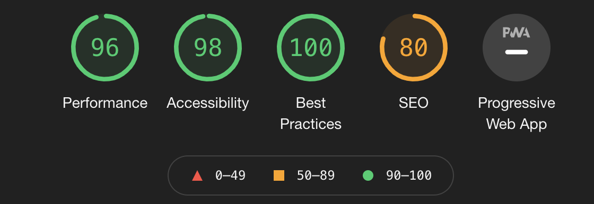

# Label-dragger player

### Overview
 - this project is written with the newest technologies stack: React + Redux (hook API), Typescript, Jest for testing and ESLint + Prettier for code linting.

### Prerequisites: 
 - node
 - npm

### To start the application run the following:
 - npm i
 - npm start

### The following open source libs where used:
- axios - for HTTP requests. Docs: github.com/axios/axios, Repo: github.com/axios/axios
- video-react - for video player. Docs: , Repo: 
- react-draggable - for dragging events. Docs: https://github.com/video-react/video-react#readme, Repo: github.com/video-react/video-react
- react-spinners - for loading animation. Docs: github.com/davidhu2000/react-spinners, Repo: github.com/davidhu2000/react-spinners
- react-loading-overlay - for darkout during the loading. Docs: https://github.com/derrickpelletier/react-loading-overlay#readme, Repo: https://github.com/derrickpelletier/react-loading-overlay
- react - UI framework. Docs: reactjs.org/, Repo: github.com/facebook/react
- redux - state management. Docs: redux.js.org, Repo: github.com/reduxjs/redux

### Performance was checked with Lighthouse:

### Test strategies:
- this repo contains UI snapshot tests (with click/hover/drag events covered), unit tests and integration tests written using Jest. There could be written more and more tests for each module for better coverage.
- Also for more accurate UI tests we can use such tools as Selenium or Puppeteer.
- All implemented test strategies are easy to run during CI/CD (just run npm script) 
